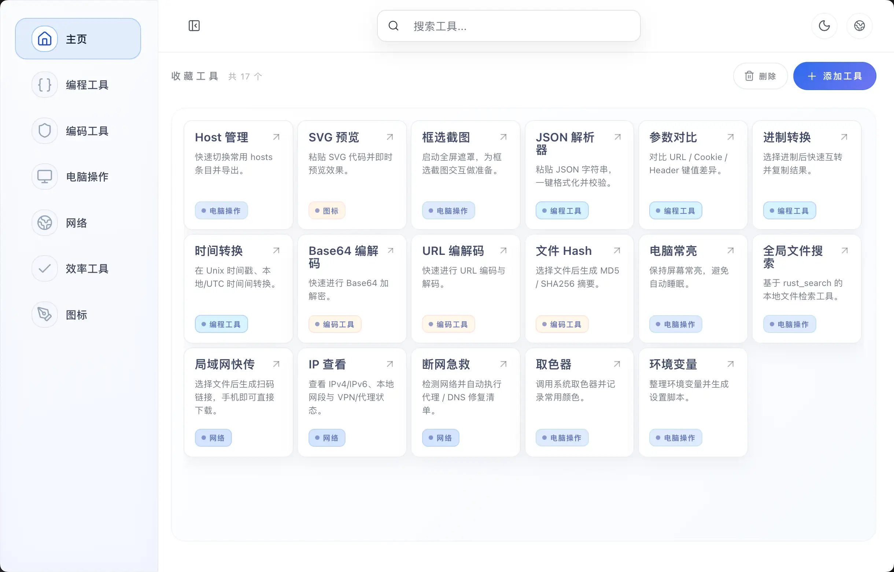
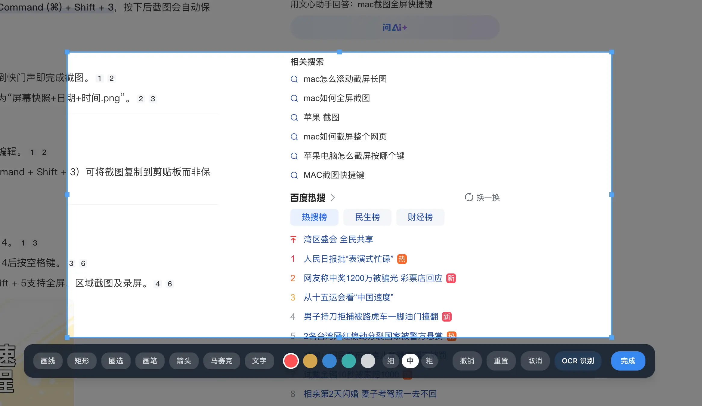
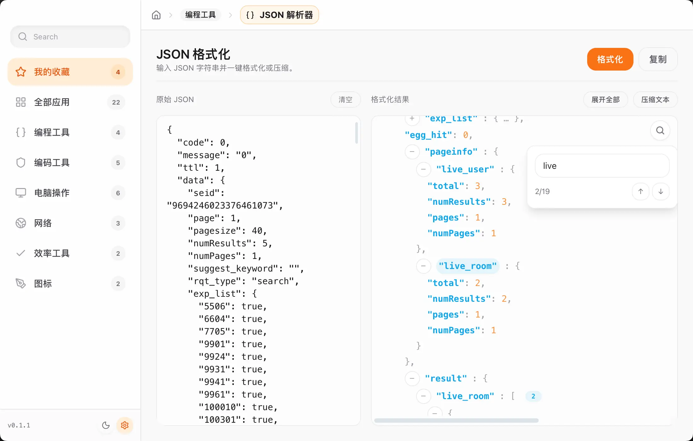

<p align="center">
  
</p>

<h1 align="center">Chef 桌面工具箱</h1>

Chef 是一个基于 **Tauri 2 + Next.js** 构建的多功能桌面工具集合。项目聚焦开发者与创作者的日常效率场景，将常用的生产力工具组合在一个统一的体验中。

目前项目处于预览阶段，很多功能和UI还没有完整实现。

## 已实现功能示例

- **框选截屏 + OCR**：调用 Tauri 原生遮罩完成区域截图，并内置 PaddleOCR模型识别截图文字。
- **局域网文件传输**：通过内置 HTTP 服务生成二维码/链接，实现局域网设备的文件下发。
- **本地文件搜索**：封装 rust_search 与系统目录选择器，可筛选路径、实时预览命中结果。
- **JSON 工具集**：支持格式化、折叠、搜索、差异对比等操作，便于调试接口或结构化数据。
- **IP / 网络概览**：IP 查看工具列出本机 IPv4/IPv6、子网、代理/ VPN 状态，并可查看 hosts/ 环境代理等信息。
- **环境变量查看器**：自动读取 macOS/Linux shell 配置及 Windows 注册表，按“键值”“路径”分类展示，支持复制。
- **Hosts 管理面板**：解析系统 hosts 文件（macOS/Linux `/etc/hosts`、Windows `System32/drivers/etc/hosts`），展示启用状态、IP、域名，可一键复制整行或全部。

<p align="center">
  <figure>
    
    <figcaption>图 1：首页收藏页</figcaption>
  </figure>
  <figure>
    
    <figcaption>图 2：框选截屏</figcaption>
  </figure>
  <figure>
    
    <figcaption>图 3：JSON 工具</figcaption>
  </figure>
</p>

## 环境要求

- Node.js 18+
- [pnpm](https://pnpm.io) 10+
- Rust 工具链

## 快速开始

```bash
# 安装依赖
pnpm i

# 启动桌面调试（Tauri + Next）
pnpm tauri dev

# 构建系统安装包
pnpm tauri build
```


## 贡献与反馈

欢迎通过 Issue/PR 提交新工具或改进体验。
